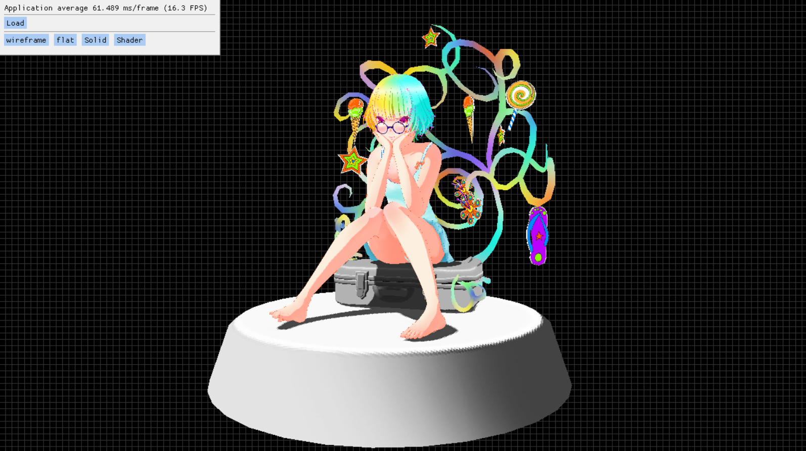
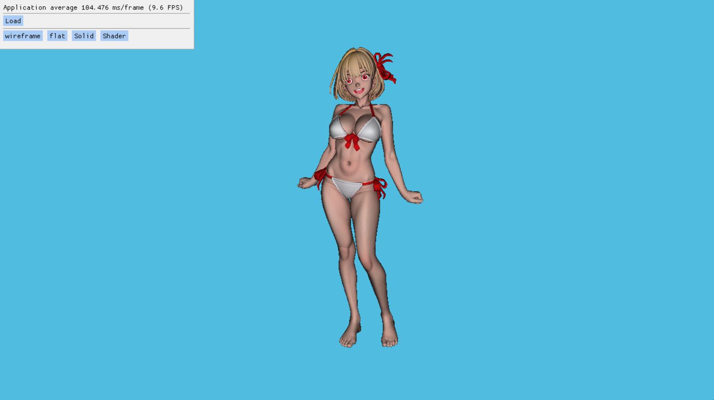

# Software Renderer in C++

본 프로젝트는 **OpenGL, DirectX, Vulkan 등과 같은 외부 3D 그래픽 API**를 사용하지 않고, **C++만으로 구현된 소프트웨어 3D 렌더러**입니다. 저수준 렌더링 파이프라인을 직접 구축함으로써 3D 그래픽스의 근본적인 원리와 내부 동작 메커니즘을 학습하는 것을 목표로 합니다.

## 주요 특징

- **C++만을 사용한 렌더링 엔진 구현**  
  3D 모델 로딩, 정점 변환, 절두체 컬링, 클리핑, 래스터라이제이션, Z-buffer, 텍스처 매핑, 간단한 조명 모델 등을 직접 구현하였습니다.
  
- **그래픽 라이브러리 비사용**  
  OpenGL, DirectX, Vulkan 등의 하드웨어 가속 그래픽 API는 전혀 사용하지 않았으며, 모든 렌더링 로직은 CPU에서 직접 수행됩니다.

- **윈도우 출력은 SDL2를 사용**  
  [SDL2(Simple DirectMedia Layer)](https://www.libsdl.org/) 윈도우 창 생성, 이벤트 처리 및 프레임버퍼 출력을 담당합니다.

- **직접 구현한 렌더링 파이프라인**
  - 모델 로딩 (OBJ, glTF(https://github.com/syoyo/tinygltf/))
  - 모델/뷰/투영 변환 (Object -> World -> Camera -> Clip -> Screen)
  - 절두체 컬링(Frustum Culling), 클리핑(Clipping)
  - 바리센트릭 좌표 기반 삼각형 래스터라이제이션
  - 깊이 테스트(Z-buffer)
  - 확산 조명(Lambert)
  - 원근 보정 텍스처 매핑

## 개발 목적

본 프로젝트는 **3D 그래픽스 렌더링 파이프라인**을 직접 구현하여, 수학적 기초부터 알고리즘 구현까지, 3D 그래픽스 렌더링 파이프라인의 전 과정을 학습하는 것을 목표로 합니다.

## 🖼️ 샘플 렌더 결과

파일 출처 : https://sketchfab.com/3d-models/just-a-girl-b2359160a4f54e76b5ae427a55d9594d

파일 출처 : https://sketchfab.com/3d-models/bikini-girl-sf-101-568316e9e1724a288b1559ef96abeff9

파일 출처 : https://sketchfab.com/3d-models/robot-toy-0ecb59f96be244ae884ecf10f1689023