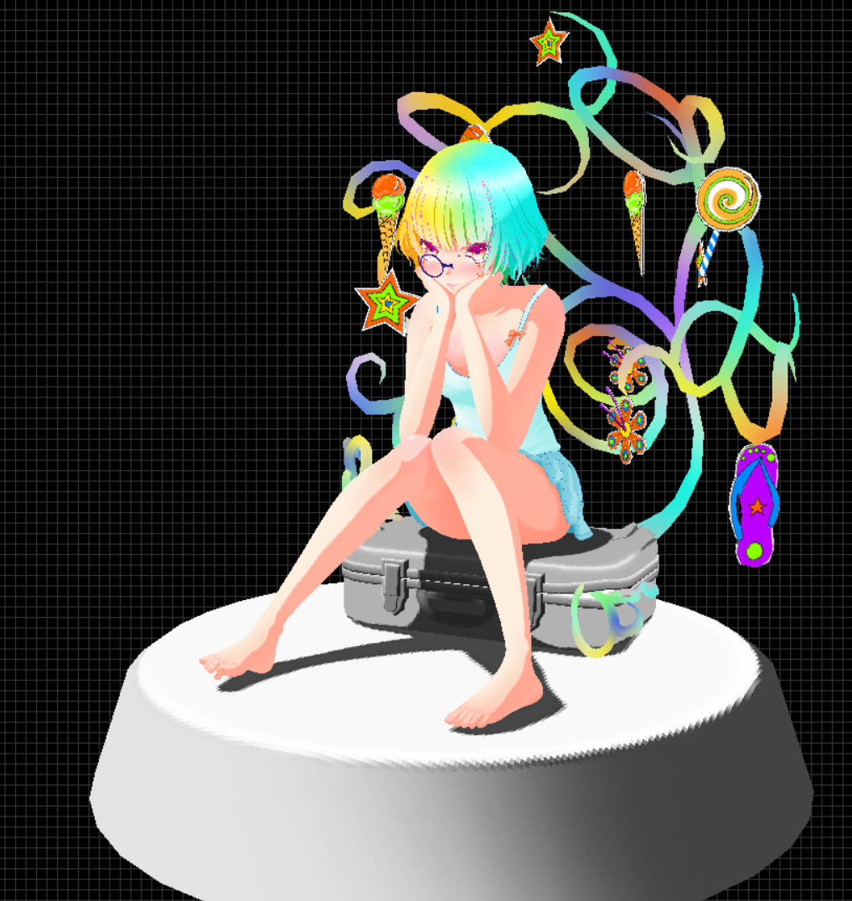

# Software Renderer in C++

이 프로젝트는 **외부 3D 그래픽 라이브러리(OpenGL, DirectX, Vulkan 등)** 없이, **C++만으로 구현된 소프트웨어 기반의 3D 렌더러**입니다. 저수준의 렌더링 파이프라인을 직접 구축함으로써, 3D 그래픽스의 근본적인 원리와 작동 방식을 이해하는 데 초점을 두고 있습니다.

## 주요 특징

- **C++만을 사용한 렌더링 엔진 구현**  
  3D 모델의 로딩, 정점 변환, 래스터라이제이션, Z-buffer 기반의 깊이 테스트, 투영 변환, 텍스처 매핑, 간단한 조명 모델 등을 직접 구현하였습니다.
  
- **그래픽 라이브러리 비사용**  
  OpenGL, DirectX, Vulkan 등의 하드웨어 가속 그래픽 API는 전혀 사용하지 않았으며, 모든 렌더링 로직은 CPU에서 직접 수행됩니다.

- **윈도우 출력은 SDL2를 사용**  
  렌더링된 결과물을 화면에 출력하기 위해 최소한의 플랫폼 종속성을 갖는 [SDL2(Simple DirectMedia Layer)](https://www.libsdl.org/) 라이브러리를 사용했습니다. SDL은 윈도우 창 생성, 이벤트 처리 및 픽셀 버퍼 출력을 담당합니다.

- **기본 3D 파이프라인 직접 구현**
  - 월드/뷰/프로젝션 행렬을 통한 정점 변환
  - 삼각형 기반의 래스터라이제이션
  - 깊이 버퍼를 이용한 시야 가림 처리(Z-buffering)
  - 고정 기능 기반의 단순 조명 모델(Lambert shading)
  - 텍스처 좌표 보간 및 텍스처 샘플링

## 개발 목적

이 프로젝트는 3D 그래픽스의 근본적인 렌더링 과정(소프트웨어 방식)을 직접 구현함으로써, 현대 GPU가 내부적으로 수행하는 파이프라인 처리에 대한 깊은 이해를 목표로 합니다.

## 🖼️ 샘플 렌더 결과

파일 출처 : https://sketchfab.com/3d-models/just-a-girl-b2359160a4f54e76b5ae427a55d9594d

파일 출처 : https://sketchfab.com/3d-models/robot-toy-0ecb59f96be244ae884ecf10f1689023